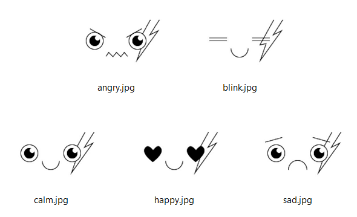
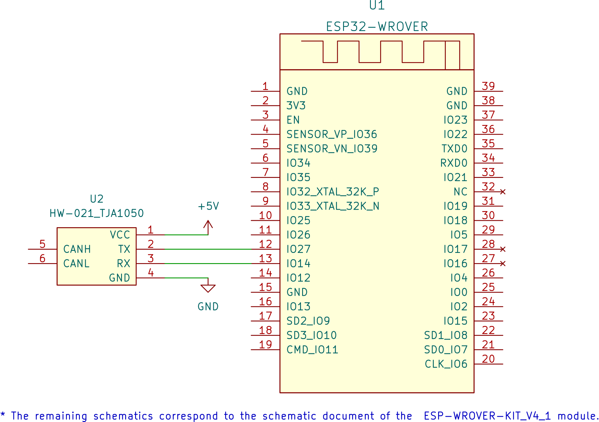

# IO: Face Unit

The Face unit consists of two modules:

- ESP-WROVER-KIT_V4_1
- TJA-1050 CAN driver module

The Unit can display a set of face expression by a command via the qCAN protocol. Each facial expression is defined by a jpg file:

(see [lib_zakhar_faces](https://github.com/Zakhar-the-Robot/lib_zakhar_faces) for the sources)

## Communication

- Protocol: **qCAN 0.2.0**, standard CAN frame
- Address: **0x4**

## Commands

Each command should consists of a single byte

|Expression|Command code|
|----------|------------|
|Anger     |0x32        |
|Blink     |0x31        |
|Calm      |0x30        |
|Pleasure  |0x33        |
|Sadness   |0x34        |

## Schematic

